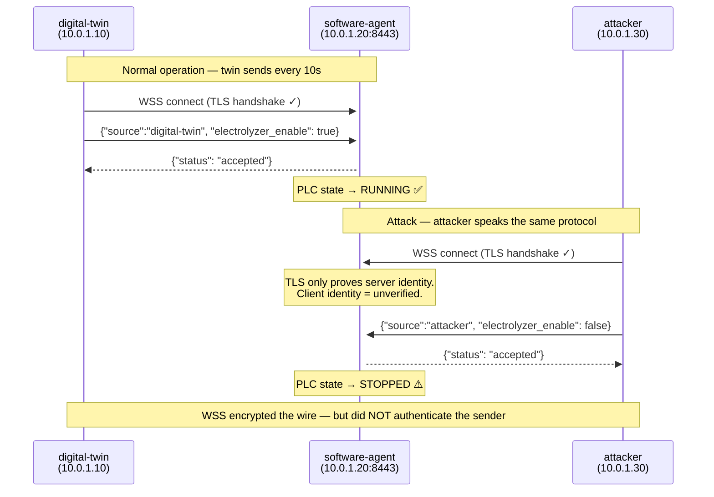
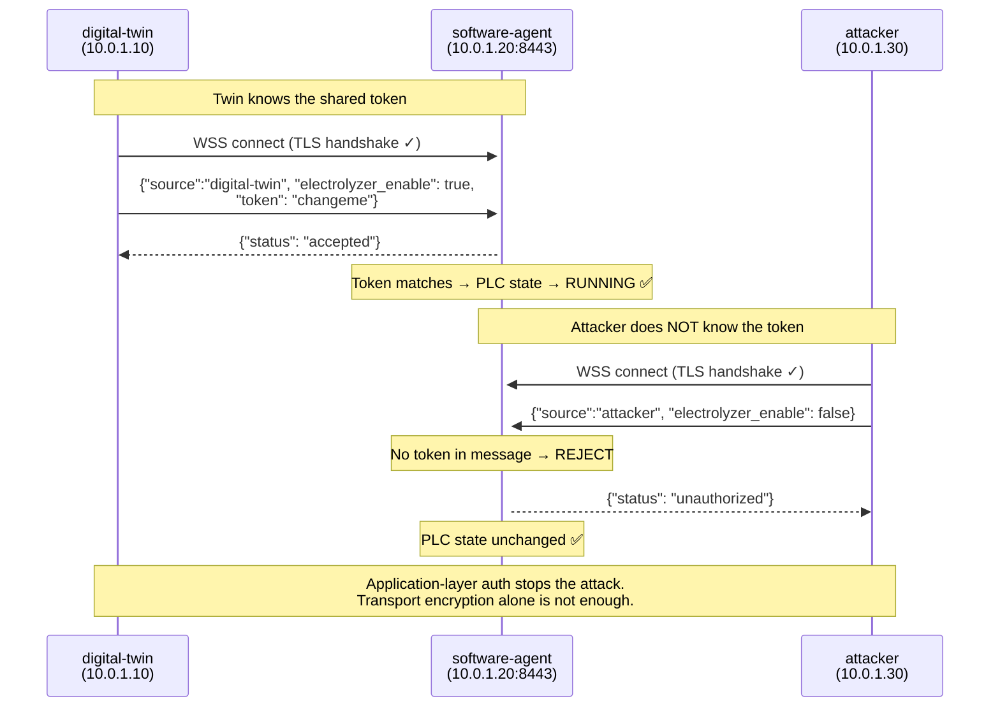

# WSS Unauthorized Client Attack — Diagram

## Infrastructure

```
Azure VNet 10.0.0.0/16
┌─────────────────────────────────────────────────────────────────┐
│                                                                 │
│  ┌──────────────────┐          ┌──────────────────────────┐    │
│  │   digital-twin   │          │      software-agent      │    │
│  │   10.0.1.10      │──WSS──▶  │      10.0.1.20:8443      │    │
│  │   (twin.py)      │          │      (agent.py)          │    │
│  └──────────────────┘          └──────────────────────────┘    │
│           ▲                               ▲                     │
│    public IP                              │                     │
│  (SSH entry point)                        │                     │
│                                           │                     │
│  ┌──────────────────┐                     │                     │
│  │    attacker      │──WSS──────────────▶ │                     │
│  │   10.0.1.30      │   (same protocol,   │                     │
│  │  (attacker.py)   │    no token)        │                     │
│  └──────────────────┘                     │                     │
│                                           │                     │
└─────────────────────────────────────────────────────────────────┘
```

---

## Phase A — The Vulnerability (AUTH_MODE=none)



---

## Phase B — The Fix (AUTH_MODE=token)



---

## Key Takeaway

| Property | WSS (TLS transport) | Token auth (Phase B) |
|---|---|---|
| Wire encryption | Yes | Yes |
| Server identity verified | Yes (server cert) | Yes (server cert) |
| **Client identity verified** | **No** | **Yes** |
| Attacker blocked | No | Yes |

> **WSS encrypts the conversation. It does not verify who is speaking.**
> Authentication must be enforced at the application layer.
