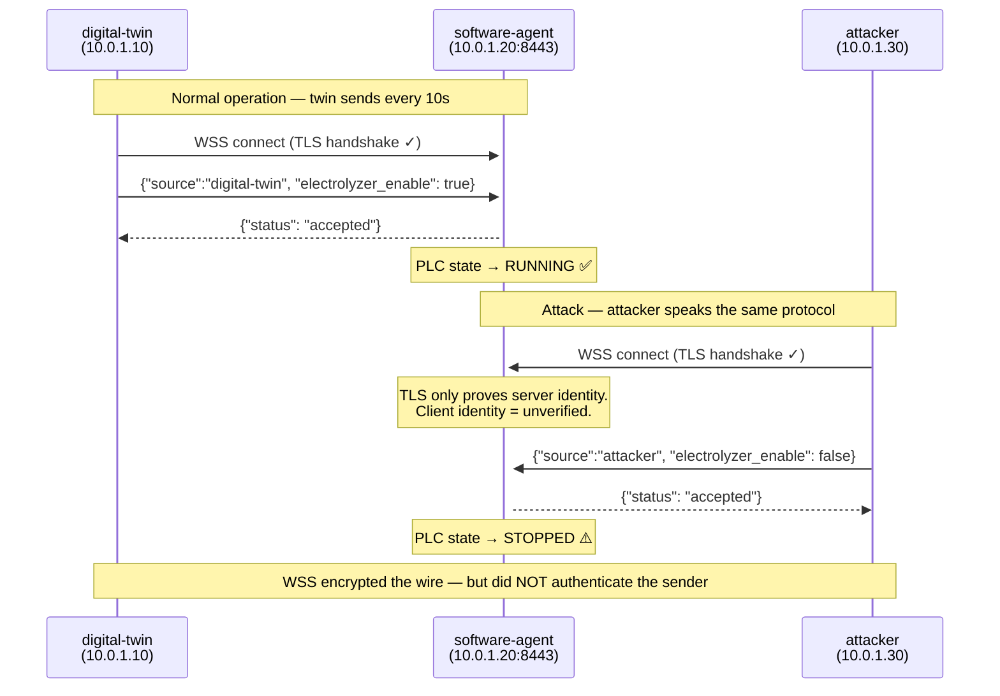
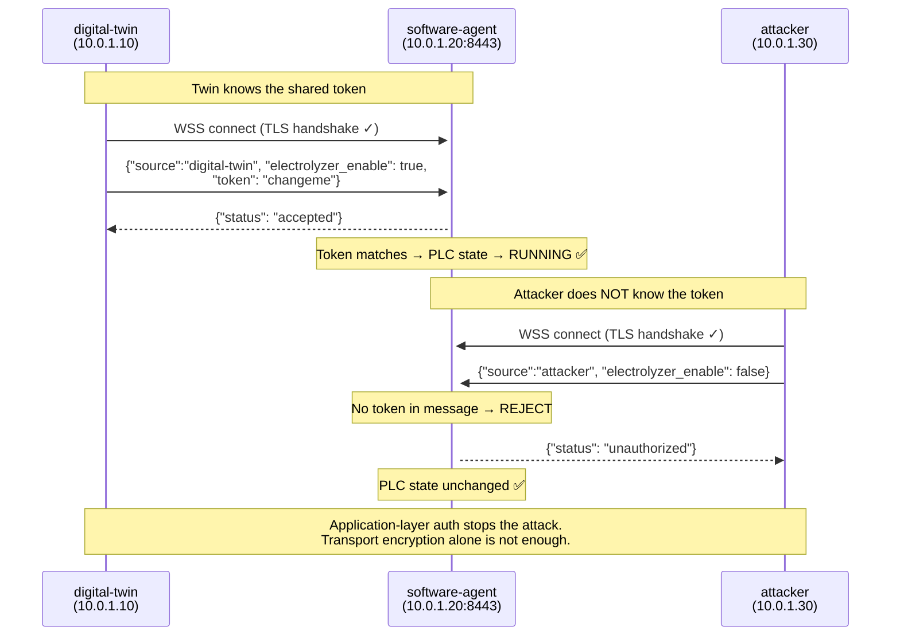
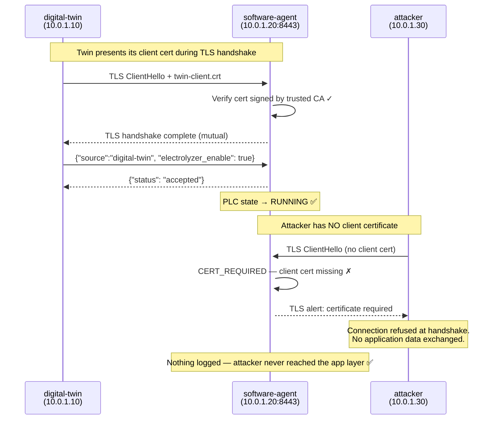

# WSS Unauthorized Client Attack — Diagram

## Infrastructure

```
Azure VNet 10.0.0.0/16
┌─────────────────────────────────────────────────────────────────┐
│                                                                 │
│  ┌──────────────────┐          ┌──────────────────────────┐    │
│  │   digital-twin   │          │      software-agent      │    │
│  │   10.0.1.10      │──WSS──▶  │      10.0.1.20:8443      │    │
│  │   (twin.py)      │          │      (agent.py)          │    │
│  └──────────────────┘          └──────────────────────────┘    │
│           ▲                               ▲                     │
│    public IP                              │                     │
│  (SSH entry point)                        │                     │
│                                           │                     │
│  ┌──────────────────┐                     │                     │
│  │    attacker      │──WSS──────────────▶ │                     │
│  │   10.0.1.30      │   (same protocol,   │                     │
│  │  (attacker.py)   │    no token)        │                     │
│  └──────────────────┘                     │                     │
│                                           │                     │
└─────────────────────────────────────────────────────────────────┘
```

---

## Phase A — The Vulnerability (AUTH_MODE=none)



---

## Phase B — The Fix (AUTH_MODE=token)



---

---

## Phase C — mTLS (AUTH_MODE=mtls)

A shared token is application-layer authentication — it can be leaked or brute-forced.
Mutual TLS (mTLS) moves client verification into the TLS handshake itself, before any
application data is exchanged. The agent requires a client certificate signed by the
trusted CA. Only the legitimate twin has one; the attacker does not.

```
PKI for this PoC
────────────────
  WSS-PoC-CA  (self-signed)
  ├── agent-vm server cert  (presented by agent, verified by all clients)
  └── digital-twin client cert  (presented by twin, verified by agent)

  Attacker: knows the CA, can verify the server — but has NO client cert.
```



**What changes on the VMs:**
- Agent: `ssl.CERT_REQUIRED` + `load_verify_locations(ca.crt)` — handshake fails without a CA-signed client cert
- Twin: `load_cert_chain(twin-client.crt, twin-client.key)` — presents cert during handshake
- Attacker: no client cert files deployed — SSL error at connect, attack script logs the block

**Switch to Phase C:**
```bash
./scripts/demo.sh phase-c-on
```

**Confirm the twin still works:**
```bash
./scripts/demo.sh logs-twin   # should see: "mTLS OK"
```

**Confirm the attacker is blocked at the TLS layer:**
```bash
./scripts/demo.sh attack-once
# Expected: "ATTACK BLOCKED at TLS layer (AUTH_MODE=mtls)"
# Agent log: no entry — attacker never reached the application handler
```

---

## Key Takeaway

| Property | WSS/Phase A (no auth) | Token/Phase B | mTLS/Phase C |
|---|---|---|---|
| Wire encryption | Yes | Yes | Yes |
| Server identity verified | Yes (server cert) | Yes (server cert) | Yes (CA-signed cert) |
| **Client identity verified** | **No** | **App layer (token)** | **TLS layer (cert)** |
| Attacker blocked | No | Yes (if token unknown) | Yes (no cert = no handshake) |
| Auth can be bypassed if | — | Token leaked/guessed | CA private key stolen |
| Block point | — | Application handler | TLS handshake |

> **mTLS moves authentication below the application layer.**
> An attacker without a valid CA-signed client certificate cannot complete the TLS
> handshake — no JSON is ever parsed, no handler is ever called.
